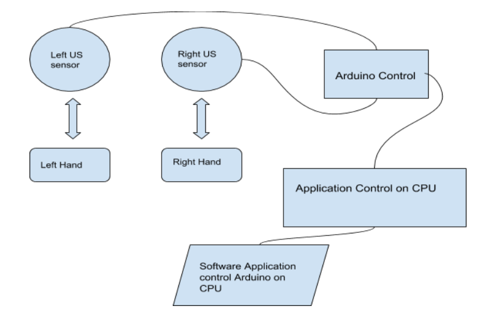
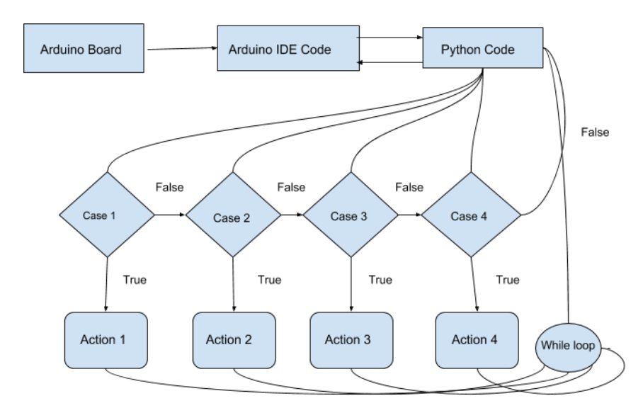

# HandMovement-AppControl

Project implements application control by hand movements. VLC and Chrome browser applications were controlled as final result. US sensors, Arduino and a Python script were used.

### Objective

Objective of the project is to implement a Arduino based hand gesture control where you can control few functions of your web browser like switching between tabs, scrolling up and down in web pages, shift between tasks (applications), play or pause a video and increase or decrease the volume (in VLC Player) with the help of hand gestures.

### Summary

In this project, we try building our own Gesture Control Laptop/Computer by combining the Power of Arduino and Python programing language. The concept behind this project is very simple. We will place two ultrasonic sensors on the top of the display and use the ​Arduino to read the distance between the display and with our hand which will be used as input gesture that we will perform some operations on VLC and Web browser. So to perform an Arduino as input keyboard for a computer we will use some operation in our computer, and for this, we will use the Python ​pyautogui library. ​Arduino commands are sent to the computer through the serial port (USB). The data will be read in python running on our computer and will take an action based on the data read.

The position of the Ultrasonic Sensors is very important. Place the two Ultrasonic Sensors on the top of a laptop screen at either end or on the bottom corners of laptop. The distance information from Arduino is collected by a Python Program and library pyautogui will convert the data into keyboard click actions.

### System Design

Recently ​Gesture controlled Laptops or computers are getting very famous. This technique is called ​Leap motion which enables us to control certain functions on our computer/Laptop by simply waving our hand in front of it. In this project i try build my own ​Gesture control Laptop/Computer by combining the Power of Arduino and Python. The principle behind the Arduino based Hand Gesture Control of Computer is actually very simple. All you have to do is use two Ultrasonic Sensors with Arduino, place your hand in front of the Ultrasonic Sensor and calculate the distance between the hand and the sensor. Using this information, relevant actions in the computer can be performed. Once arduino collects distance information it send a signal to software running on CPU written in python stating what action needs to be performed. That action took place on the desired application.

### Components

* Arduino UNO x 1
* Ultrasonic Sensors x 2
* USB Cable (for Arduino)
* Few Connecting Wires
* A Laptop with internet connection

It consists of an Arduino UNO board and two Ultrasonic Sensors and you can power up all these components from the laptop’s USB Port. The design of the circuit is very simple, but the setup of the components is very important. The Trigger and Echo Pins of the first Ultrasonic Sensor (that is placed on the left of the screen) are connected to Pins 11 and 10 of the Arduino. For the second Ultrasonic Sensor, the Trigger and Echo Pins are connected to Pins 6 and 5 of the Arduino. Now, coming to the placement of the Sensors, place both the Ultrasonic Sensors on top of the Laptop screen, one at the left end and the other at right. Coming to Arduino, place it on the back of the laptop screen. Connect the wires from Arduino to Trigger and Echo Pins of the individual sensors.

### Software Design and Operation

The important part of this project is to write a program for Arduino such that it converts the distances measured by both the sensors into the appropriate
commands for controlling certain actions. The hand gestures in front of the Ultrasonic sensors can be calibrated so that they can perform different tasks on
your computer.

* Switch to Next Tab in a Web Browser
* Switch to Next Tab in a Web Browser
* Scroll Down in a Web Page
* Scroll Up in a Web Page
* Switch between two Tasks (Chrome and VLC Player)
* Play/Pause Video in VLC Player
* Increase Volume
* Decrease Volume

Writing python program for Arduino based Hand Gesture Control is very simple. We just need to read the Serial data from Arduino and invoke certain keyboard key presses. In order to achieve this, we have to install a special python module named PyAutoGUI. With the help of PyAutoGUI, we can write a Python Program to mimic the actions of mouse like left click, right click, scroll, etc. and keyboard like keypress, enter text, multiple key press, etc. without physically doing them. Let us install PyAutoGUI.

We can write a simple Python Code that will execute the following tasks of keyboard and mouse.

* Data = “next” – – &gt; Action = Ctrl+PgDn
* Data = “previous” – – &gt; Action = Ctrl+PgUp
* Data = “down” – – &gt; Action = Down Arrow
* Data = “up” – – &gt; Action = Up Arrow
* Data = “change” – – &gt; Action = Alt+Tab

### Results

After complete implementation of the Arduino and Python program, it is observed that VLC control using hand gesture was smooth and responsive while compared to Web browser application control. VLC control was able to do Play/Pause, Increase/Decrease volume and Forward/Rewind of the video. Whereas in Browser only tabs are changing with good response whereas scrolling takes time or then application becomes unresponsive.

### Difficulty Faced

While developing this, a stage was occurred where either Arduino or Computer goes in deadlock and do not response as if Browser or VLC do not want to release the control, even Python program faced this problem while running. One more difficulty faced was that the Python program should be version 2.x not 3.x which caused me a total of 3 hours to figure it out because version 3.x will read Byte strings in serial communication by Arduino and version 2.x skips this security version while helping to program this project. Also, same program cannot be used for every application unless each application provides same hotkeys for the control using keyboard. Therefore, separate programs have to be written for several application. Hence, VLC and Browser code are in separate files.

### Future Extension

In this project, I have implemented Arduino based Hand Gesture Control of Computer, where few hand gestures made in front of the computer will perform certain tasks in the computer without using mouse or keyboard. Such Gesture based Control of Computers is already present and a company called Leap Motion has been implementing such technology in computers. This type of hand gesture control of computers can be used for VR (Virtual Reality), AR (Augmented Reality), 3D Design, Reading Sign Language, etc.

This project can be extended for several applications that involves hotkeys operations and as well are responsive while execution. Also mouse control can also be achieved using US sensors that can show like less distance then move down or more distance then move up.
